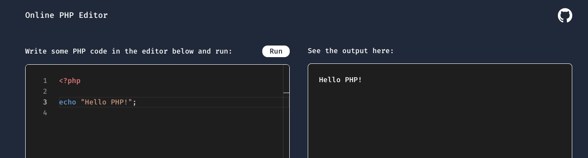

<h2 align="center">Online PHP Interpreter</h2>

### Why?
Sometimes I use a random online PHP interpreter to execute a simple PHP block of code quickly.
From time to time, I was wondering, "Is it really complicated to implement such an online platform? How does it work?"

From that question, I tried to figure it out by implementing this fun side project. 

Turned out, it's not that hard. 🤓

Here is how it works:

- From the editor in the browser I send the code in the back-end
- I create a temporary `PHP` file
- I execute it with the `PHP interpreter` on the server
- I return the output and show it in the browser

That's literally it! 🚀

### Tech used

- [TailwindCSS](https://tailwindcss.com/)
- [Laravel](https://laravel.com/)
- [Monaco editor](https://github.com/microsoft/monaco-editor)

### Inspiration

The UI and implementation of this project is largely inspired from an excellent project called [PHPAST](https://phpast.com/) by [Ryan Chandler](https://twitter.com/ryangjchandler).

### Caution
This project is intended for experiment. There might be some security issues. Because this is just executing anything is sent from the browswer.

**So, DON'T RUN THIS ON YOUR PRODUCTION SERVER, unless you take necessary security measures!**

### Contribution
Ideas and contributions are welcome! 🙌
